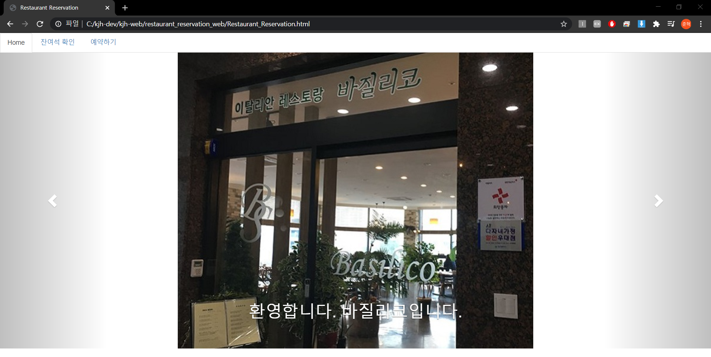
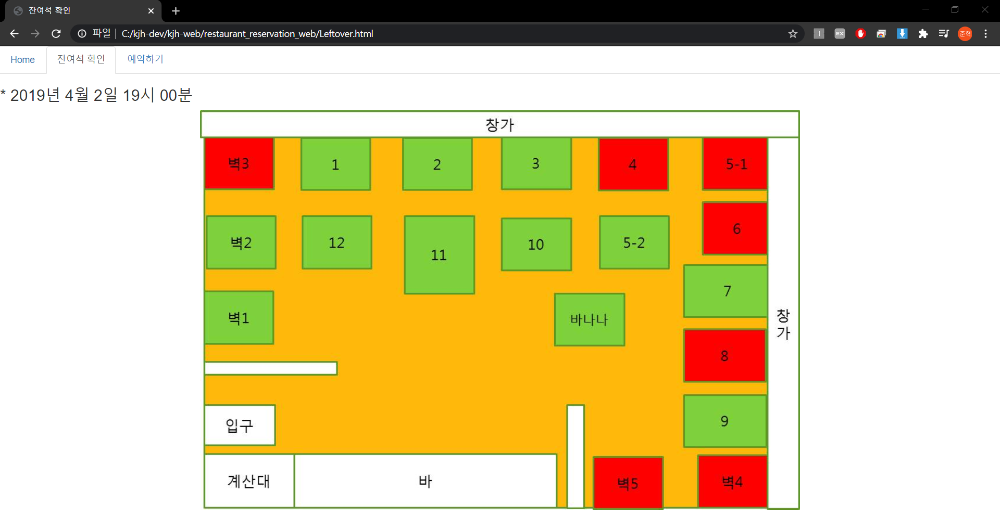

# restaurant_reservation_web
>학부생 3학년 1학기 때 개발하려고 한 레스토랑 예약용 웹 사이트(기능 미구현)

## Installation

크롬 브라우저로 실행함

## Usage example

레스토랑 예약용 웹 사이트 개발

잔여석 확인, 예약 등의 기능 수행 예정

## Development setup

HTML, CSS

## Release History

* 1.0.0
    * first
    * 목업 구현 완료

## Meta

김준혁 – wnsgur1198@naver.com

## Contributing

1. Fork it (<https://github.com/yourname/yourproject/fork>)
2. Create your feature branch (`git checkout -b feature/fooBar`)
3. Commit your changes (`git commit -am 'Add some fooBar'`)
4. Push to the branch (`git push origin feature/fooBar`)
5. Create a new Pull Request

<!-- Markdown link & img dfn's -->
